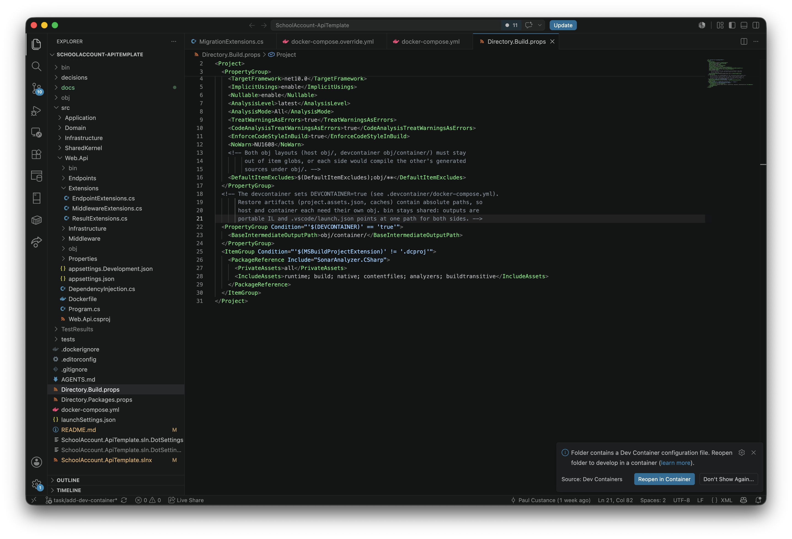
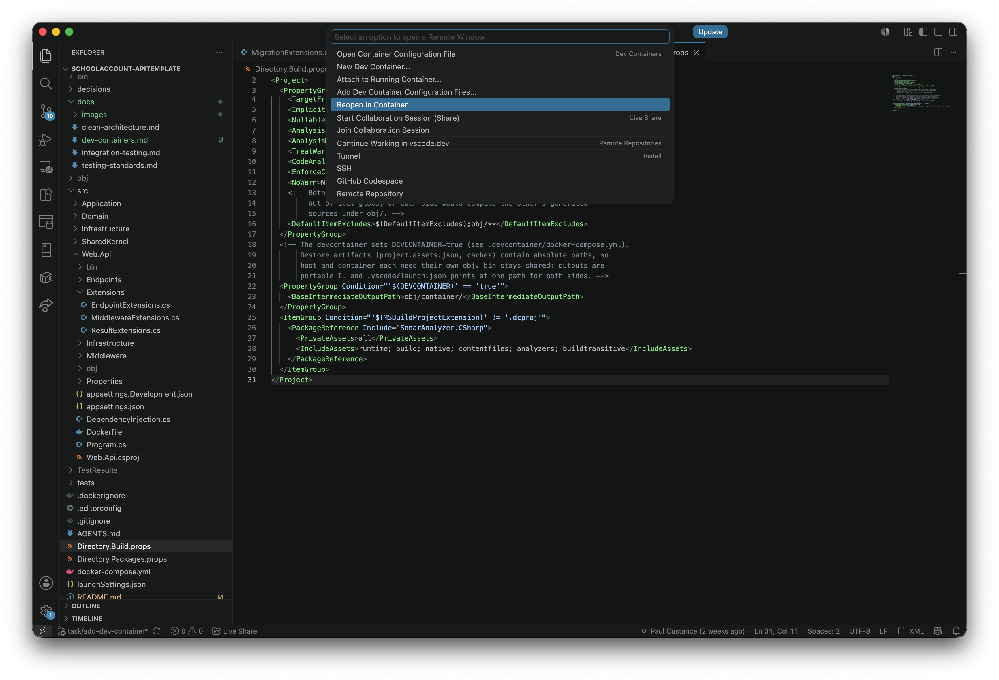
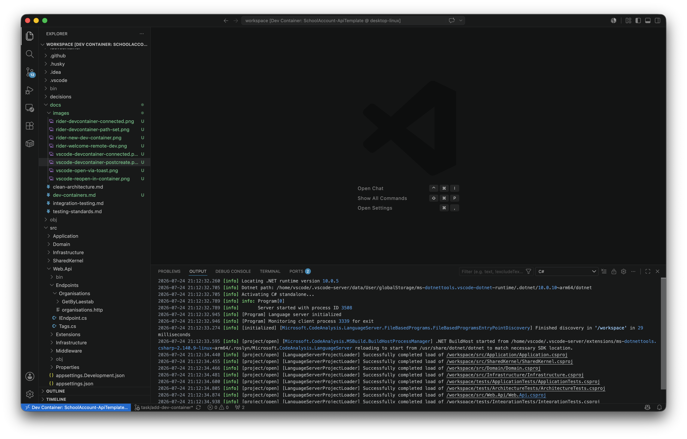
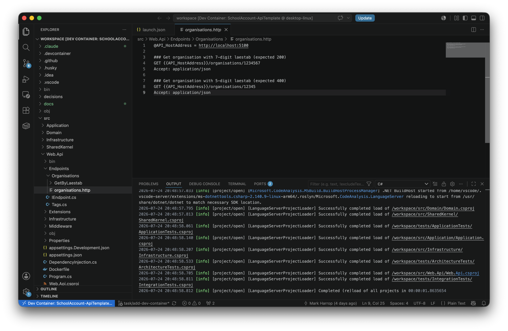
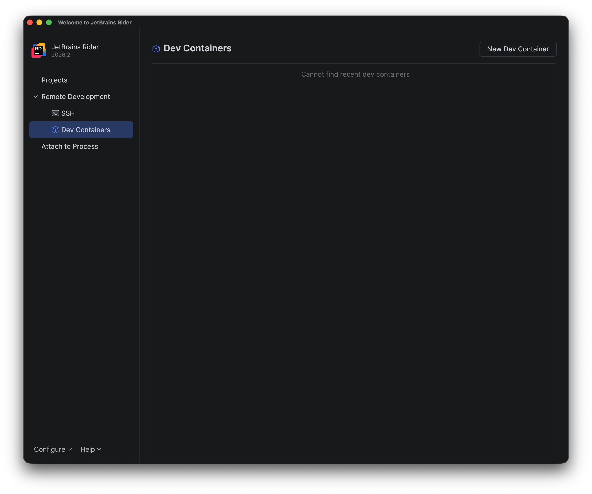
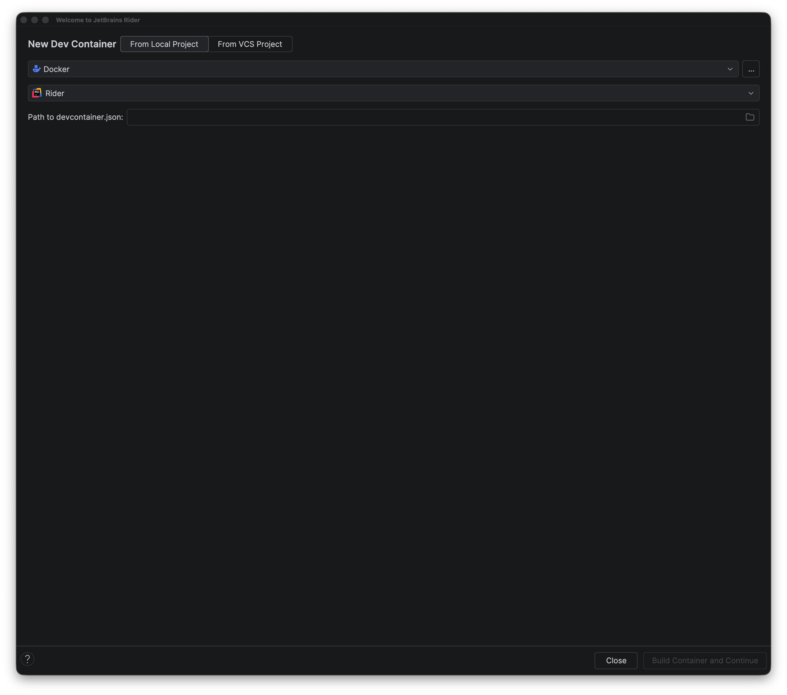
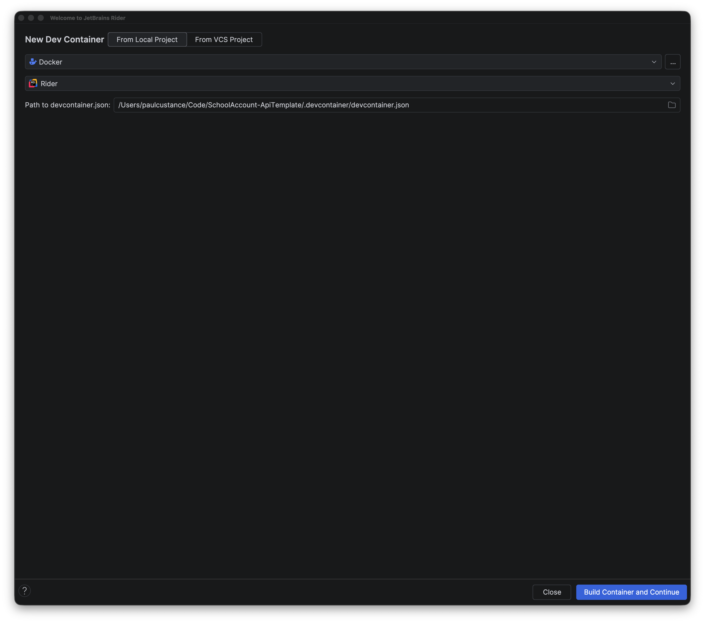
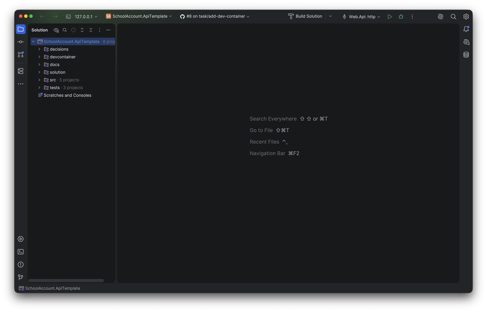

# Dev Containers

The repository ships a [Dev Container](https://containers.dev/) definition in [.devcontainer](../.devcontainer), so you
can develop inside a container with the .NET SDK, Docker CLI, and GitHub CLI already installed, without setting any of
it up on your host machine.

## What it gives you

- A container built from [.devcontainer/Dockerfile](../.devcontainer/Dockerfile), with the workspace mounted at
  `/workspace`.
- `seq` started alongside it, so logs are available the same way they are with `docker compose up`.
- Port `5100` (the API) and Seq's UI port forwarded automatically.
- `dotnet restore` run once as the container is created (`postCreateCommand`).
- In VS Code, extensions listed under `customizations.vscode.extensions` in
  [devcontainer.json](../.devcontainer/devcontainer.json) install automatically on first connect. Currently just
  [REST Client](https://marketplace.visualstudio.com/items?itemName=humao.rest-client) for running the `.http` files.
  Add more extension IDs to that array as needed; it doesn't apply to Rider, which manages its own plugins.

## Prerequisites

- [Docker Desktop](https://www.docker.com/products/docker-desktop/), running before you open the project.
- VS Code with the [Dev Containers extension](https://marketplace.visualstudio.com/items?itemName=ms-vscode-remote.remote-containers),
  or Rider 2024.1+ (Dev Containers support is built in, no plugin required).

## VS Code

1. Open the repository folder in VS Code. If the [Dev Containers extension](https://marketplace.visualstudio.com/items?itemName=ms-vscode-remote.remote-containers)
   detects the `.devcontainer` folder, it offers a toast notification to reopen in the container. Click
   **Reopen in Container** and skip to step 3.

   

2. Otherwise, click the `><` Remote indicator in the bottom-left corner of the window (or open the Command Palette
   and run **Dev Containers: Reopen in Container**) and choose **Reopen in Container** from the list:

   

3. VS Code builds the container image and runs `postCreateCommand` (`dotnet restore`) in the integrated terminal.
   This takes a few minutes the first time; later opens reuse the cached image and are much faster.

   

4. Once connected, the status bar shows **Dev Container: SchoolAccount-ApiTemplate**, and the integrated terminal
   runs inside the container. Use it to run `dotnet run --project src/Web.Api`, `dotnet test`, etc. as usual.

   

5. To leave the container, click the Remote indicator and choose **Reopen Folder Locally**, or use
   **Dev Containers: Reopen Folder Locally** from the Command Palette.

## Rider

1. From the Rider welcome screen, choose **Remote Development** (or, with a window already open,
   **File \| Remote Development...**), then **Dev Containers**:

   

2. Click **New Dev Container**, then the **From Local Project** tab, and browse to this repository's
   `.devcontainer/devcontainer.json`:

   

   Once a path is selected, **Build Container and Continue** becomes active:

   

3. Rider builds the image (reusing Docker's layer cache on subsequent builds) and then downloads and starts the Rider
   backend inside the container. This takes a few minutes the first time.
4. Once connected, a JetBrains Client window opens showing the `127.0.0.1` remote connection indicator, with the
   solution loaded exactly as it is locally:

   

5. Work as normal: run/debug configurations, the integrated terminal, and NuGet restores all execute inside the
   container. The `http` launch profile and Docker Compose run configurations both work unchanged.
6. To reconnect later, use **File \| Remote Development...** and pick the container from the recent list, or run
   `docker ps` to confirm it's still there before reconnecting.

## Debugging

Debugging works the same as running locally (see [Getting Started](../README.md#getting-started)): breakpoints in
`src/` and the `.http` files in `src/Web.Api/Endpoints` behave identically once connected, since both editors tunnel
their debugger through the remote connection automatically. There's nothing Dev Container-specific to configure.

## Troubleshooting

- **Stale image after a Dockerfile change**: rebuild without the cache , VS Code: Command Palette →
  **Dev Containers: Rebuild Container**; Rider: the Dev Containers connection dialog has a **Rebuild** action.
- **Port already in use**: something on the host is already bound to `5100` or the Seq port; stop it or change
  `forwardPorts` in [devcontainer.json](../.devcontainer/devcontainer.json).
- **Container exits immediately**: check Docker Desktop is running and has enough resources allocated (Settings \|
  Resources).
